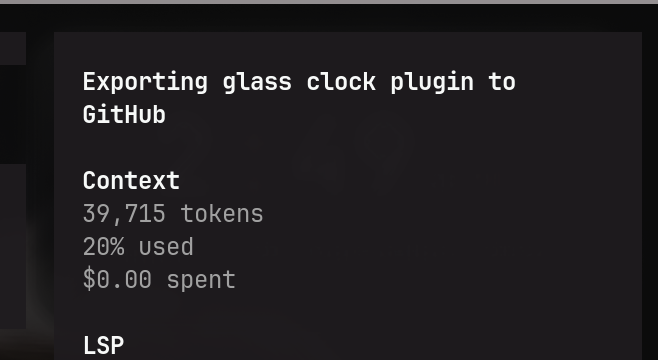

# Glass Clock

<p align="center">
  
</p>

A frosted-glass desktop clock widget for [Omarchy](https://omarchy.org).



Renders a translucent, blurred clock in the top-right corner of your primary
display using a Quickshell layer-shell surface. Glass is applied via Hyprland
`layerrule` blur so whatever is behind the widget (your wallpaper) shows
through the frosted surface.

## Features

- Frosted-glass panel with sheen and shading gradients that follows your theme
  colors, corner radius, and gaps
- Large 12-hour time with blinking colon, seconds, and AM/PM
- Date line in your theme font
- Sits in the `bottom` layer with `exclusionMode: Ignore`, so it never
  interferes with window tiling
- Automatically re-applies the glass layer rule on `configreloaded`
- Disables glass rendering automatically if Hyprland blur is disabled

## Install

Prefer the native Omarchy command:

```bash
omarchy plugin add https://github.com/indibyte/NGNK-glass-clock --enable --yes
```

Or copy/symlink this directory into your Omarchy plugins folder:

```
~/.config/omarchy/plugins/ngnk.glass-clock/
```

## Usage

1. Enable the plugin in your Omarchy config (its id is `ngnk.glass-clock`).
2. Reload the Omarchy shell.

The clock appears pinned to the top-right corner of your largest monitor.

## Note

The blur layer rule requires Hyprland's `decoration:blur` to be enabled. If you
do not want the frosted effect, the clock still renders with a higher-opacity
tinted panel.

## License

[MIT](LICENSE)
